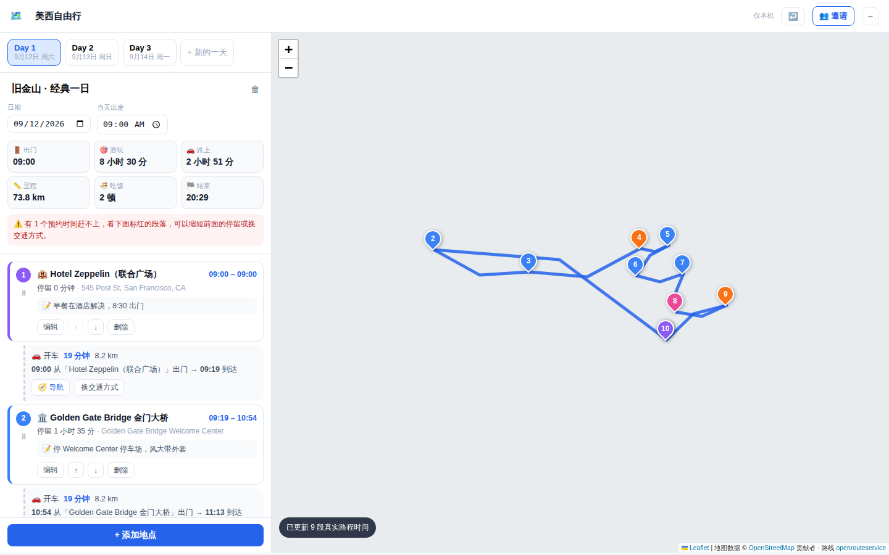
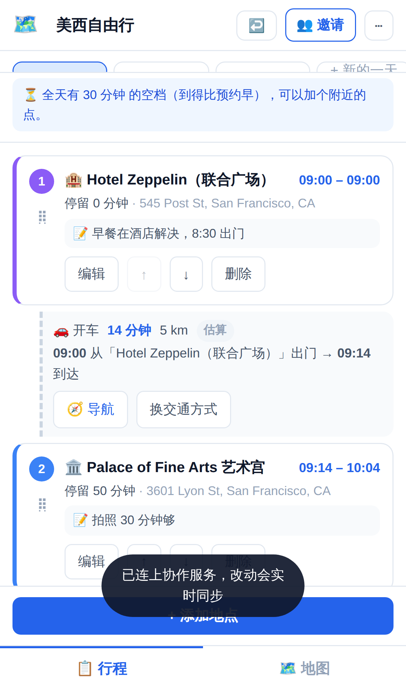
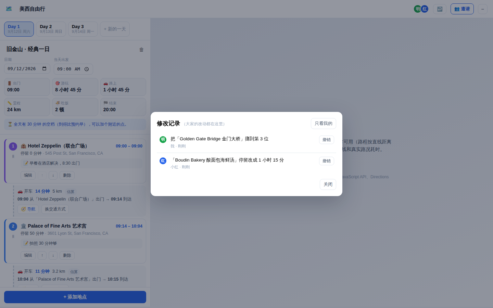

# US Routine · 美国行程时间轴

自由行行程工具：**记录「什么时间 · 在什么地方 · 做什么事」，在 Google 地图上把每天的行程打点连线，并自动算出每一段的时间账**——几点出门、玩多久、路上多久、几点必须去下一个、吃饭那顿怎么去。

手机上像 App 一样用（可添加到主屏幕），朋友拿到链接就能一起看、一起改，**改动实时同步**。

<p align="center">
  
  
</p>
<p align="center"><sub>截图在离线环境下渲染，地图底图是空白的；实际使用时是 OpenStreetMap 的街道图。</sub></p>
<p align="center">
  
</p>

---

> 📖 **给使用者的完整说明书**：[docs/使用说明.md](docs/使用说明.md) —— 界面在哪儿、每个字段什么意思、怎么和朋友协作、常见问题。

## 它替你算什么

每个地点你只填两件事：**停留多久** 和 **用什么方式过去**（开车 / 公交 / 步行 / 骑行）。剩下的自动推：

| 你关心的问题 | 界面上的位置 |
| --- | --- |
| 几点出门 | 路程卡片：`09:00 从「酒店」出门 → 09:19 到达` |
| 玩多久 | 地点卡片：`停留 1 小时 35 分`，右上角是 `09:19 – 10:54` |
| 路上多久、多远 | 路程卡片：`🚕 Uber 19 分钟 · 8.2 km`（真实值来自路线服务） |
| 几点要去下一个 | 上一个地点的离开时间就是下一段的出门时间；有预约时额外显示 `⏰ 最晚 12:18 必须出发` |
| 吃的地方怎么去 | 餐厅那段路橙色高亮，带「🍜 导航去吃饭」按钮，直接开 Google 地图导航 |
| 会不会赶不上 | 预约赶不上时标红 `❗ 已经晚了 25 分钟`，并顺延后面全部安排 |
| 有没有闲太久 | 到得比预约早会显示 `空档 23 分钟`，提示可以再塞一个点 |
| 顺序排错了 | 固定时间前后颠倒时自动挪回正确位置，多处颠倒给一个「⇅ 按时间重排」入口 |
| 到了人家关门 | 填了营业时间就核对，标出「周六不营业 / 10:00 才开门 / 17:00 关门你排到 18:30」。选地点时从 OpenStreetMap 自动填 |
| 绕了远路 | 绕得明显时提示「换个顺序大约能少绕 25 分钟」并给出前后对照 —— **只提示，点了才改**；也可以从 ⋯ 菜单主动查，排得顺时会直说「没找到更省的排法」 |
| 那天什么天气 | 当天概览显示天气与降水，地点卡片按**各自到访时段**标温度和降水概率；超过 16 天预报范围时改用往年同期并注明不是预报 |

顶部还有当天总览：出门时间、游玩总时长、路上总时长、总里程、吃几顿、几点结束。

## 多人实时协作

- 点右上角 **👥 邀请** 拿到链接，发给同行的人，打开即用，**不需要注册登录**。
- 谁改了什么，其他人 **0.1 秒左右** 就看到：改停留时间、加点删点、调顺序、改标题都会同步。
- 头像显示谁在线；有人正在编辑某个地点时，那张卡片会显示 `✏️ 小红 正在改`。
- 两个人同时改**不同的**地点不会互相覆盖——每个地点是独立的一条数据，各写各的（顺序也只是一个数字，插队不会牵动别人）。同时改**同一个字段**时，后写的生效。
- 断网照样能改，本地先存着，联网后自动补传。
- **谁都不怕改错**：右上角 ↩️ 或 `Ctrl/⌘ + Z` 撤销自己最近一次改动；「⋯ → 🕘 修改记录」里能看到大家改了什么、什么时候改的，任意一条都能单独撤销（撤销本身也会同步给同伴，并且自己也能再撤回来）。

### 关于「同时改同一个地点」

编辑框保存时**只写你真正动过的字段**，比较的基准是你打开编辑框那一刻的快照。
所以你在填停留时间的时候，同伴把这个地点改了名，你保存后他的改名不会被你手里的旧值冲掉——
两条改动都在。只有你俩改的是**同一个字段**时，才是后保存的那个生效。

## 手机使用

部署好之后用手机浏览器打开链接：

- **iPhone**：Safari → 分享 → 「添加到主屏幕」
- **Android**：Chrome → 右上角菜单 → 「安装应用」/「添加到主屏幕」

之后就是一个独立图标，全屏运行、离线可打开（离线时看的是最后一次同步的内容）。

> 主屏幕图标有独立的存储空间，读不到浏览器里存的行程和 Key。**装之前先打开邀请链接**，
> 在那个页面上「添加到主屏幕」；已经装了发现是空的，用 **⋯ → 🔗 打开行程链接** 粘一次链接就接上，只需一次。
底部有「📋 行程 / 🗺️ 地图」两个标签来回切。

**自动更新**：每次往仓库推代码，GitHub Actions 自动重新部署；App 下次打开（或从后台切回前台）会检测到新版本，自动下载并刷新，不用手动重装。

---

## 部署（一次性，约 15 分钟）

### 1. 打开 GitHub Pages

**私有仓库的 Pages 需要 GitHub Pro 及以上**。免费账号请先把仓库改成公开：
Settings → General → 最下面 Danger Zone → Change visibility → Public。

> 改公开安全吗？安全。仓库里没有任何密钥：`js/app-config.js` 是空占位，
> 真正的 Key 存在仓库 Secrets 里（公开仓库的 Secrets 依然是私密的），
> 行程数据存在 Firebase 不在仓库里。前端应用的 Maps Key 和 Firebase Web Config
> 本来就会出现在浏览器里，靠域名白名单和数据库规则保护，不靠藏。

然后 **Settings → Pages → Build and deployment → Source** 选 **GitHub Actions**。
（工作流里带了 `enablement: true` 会尝试自动开启，但 Actions 的默认令牌往往没有
创建 Pages 站点的权限，手动选一次最稳。）

推代码后 `.github/workflows/pages.yml` 会自动构建上线，地址形如
`https://<你的用户名>.github.io/US--routine/`。

> 工作流目前监听 `main` 和 `claude/us-trip-itinerary-planner-alg1ty` 两个分支，
> 方便合并前先在手机上试。只想让 `main` 上线的话，把分支列表里的另一个删掉即可。

### 2. 地图（两选一）

应用支持两套地图服务，在「⚙️ 设置 → 地图服务」里切换。

**A. OpenStreetMap（默认，不用信用卡）**

开箱即用 —— 地图打点、连线、点选联动**什么都不用配**就能看。想要真实路网耗时再补一个免费 Key：

1. 到 [OpenRouteService](https://openrouteservice.org/dev/#/signup) 用邮箱注册（免费，不需要信用卡）
2. 登录后在控制台申请一个 **Standard** token，复制
3. 应用内「⚙️ 设置 → OpenRouteService Key」粘贴

免费额度每天 2000 次路线查询，个人排行程用不完。

短板要知道：**没有实时路况**（开车耗时偏乐观）、**不支持公共交通**（那一档继续按直线估算）、POI 搜索不如 Google 全。

**B. Google 地图（需要已绑卡的 Google Cloud 账号）**

1. 到 [Google Cloud Console](https://console.cloud.google.com/google/maps-apis/credentials) 创建 API Key
2. 启用三个 API：**Maps JavaScript API**、**Directions API**、**Places API**
3. 给 Key 加「HTTP 引用来源」限制，填上你的 Pages 域名：`https://<用户名>.github.io/*`

> ⚠️ **Google Cloud 在中国大陆不提供付费服务**，结算账号的国家/地区列表里没有中国大陆，
> 也就拿不到 Maps Key。国内用户走上面的 OpenStreetMap 方案。

### 3. Firebase 实时数据库（多人同步用）

1. [Firebase 控制台](https://console.firebase.google.com/) 新建项目（可以直接选你已有的 Google Cloud 项目）
2. 左侧 **构建 → Realtime Database → 创建数据库**，位置随便选，模式先选「锁定」
3. **规则** 标签页，粘贴仓库里的 [`firebase.rules.json`](firebase.rules.json) 内容并发布
4. **身份验证 → Sign-in method**，启用 **匿名登录**（朋友无需注册就是靠这个）
5. 项目设置 → 「你的应用」里添加一个 Web 应用，复制出 `firebaseConfig`

### 4. 把 Key 交给部署流程（手机上嫌麻烦可以跳过）

> 只想快点用起来：跳过这一步，直接在应用内「⋯ → ⚙️ 设置」里粘贴 Maps Key 和
> Firebase 配置即可（存在你自己的浏览器）。这种情况下生成的邀请链接会自动带上配置，
> 朋友点开同样能用。等有电脑了再补 Secrets，让部署自带配置。


仓库 **Settings → Secrets and variables → Actions → New repository secret**，加这几条：

| Secret 名 | 值 |
| --- | --- |
| `MAPS_API_KEY` | Google Maps Key（走 OpenStreetMap 就留空） |
| `ORS_API_KEY` | OpenRouteService Key |
| `FIREBASE_API_KEY` | firebaseConfig.apiKey |
| `FIREBASE_AUTH_DOMAIN` | firebaseConfig.authDomain |
| `FIREBASE_DATABASE_URL` | firebaseConfig.databaseURL（`https://xxx.firebasedatabase.app`） |
| `FIREBASE_PROJECT_ID` | firebaseConfig.projectId |
| `FIREBASE_APP_ID` | firebaseConfig.appId |

部署时这些值会被写进 `js/app-config.js`，朋友打开链接即用，不用各自配置。

> **关于「Key 会不会泄露」**：前端应用的 Maps Key 和 Firebase Web Config 本来就是公开信息，
> 安全性靠的是 **Maps 的域名白名单** 和 **Firebase 的数据库规则**，不是靠藏起来。
> 上面第 2、3 步的限制配好就行。真正需要保密的东西（服务账号密钥之类）本项目不涉及。

### 不想部署，先在本机试

```bash
git clone <this repo> && cd US--routine
python3 -m http.server 8123        # 打开 http://localhost:8123
```

点 **⋯ → ⚙️ 设置**，把 Maps Key 和 Firebase 配置粘进去（只存在本机浏览器）。
这种情况下生成的邀请链接会把配置一起带上（`#cfg=...`），朋友点开也能直接用。

**完全不配也能用**：时间轴功能完整，只是没有地图，路程按直线距离估算并标注「估算」。

---

## 用法

- **加地点** —— 底部「+ 添加地点」。配好 Maps Key 后，弹窗顶部搜索框是 Google Places 自动补全，选中自动带回名称、地址、经纬度，并猜出类型（餐厅自动归到「吃饭」）。
- **固定时间** —— 餐厅订位、门票时段填在「固定时间」，系统会倒推最晚出发时间并检查赶不赶得上。
- **加一天** —— 日期自动接在最后一天之后；改早先某天的日期时，后面连着的天一起顺延。
- **调顺序** —— 按住卡片上的 `⠿` 手柄拖动（手机上直接按住拖，拖到列表边缘会自动滚动），或者用 ↑ ↓ 按钮。路程时间自动重算。
- **换交通方式** —— 路程卡片上的按钮循环切换 Uber → 租车 → 旅行团 → 公交 → 步行 → 骑行。前三种是同一条路、同样的耗时，分开列只是为了标记这段怎么走。
- **地图联动** —— 点卡片地图定位过去，点图钉滚到对应卡片。图钉按类型配色、带顺序编号，按行程顺序连线（有真实路线画真实路线，没有画灰色虚线）。
- **复制当天** —— 一键导成文字，直接发微信群。
- **导入 / 导出** —— JSON 备份。
- **撤销** —— 右上角 ↩️ 撤销自己最近一次改动，`Ctrl/⌘ + Z` 同样；「🕘 修改记录」里可以撤销任意一条。目标已经被别人删掉时按钮会置灰并说明原因。
- **新建行程** —— 一个链接一份行程，可以同时开好几份（比如「美西」「东岸」各一条）。

## 代码结构

```
index.html               页面骨架 + 三个弹窗（地点 / 邀请 / 设置）
assets/styles.css        样式（含手机端布局）
manifest.webmanifest     PWA 清单：可添加到主屏幕
sw.js                    Service Worker：离线可用 + 自动更新

js/app-config.js         部署时由 Actions 注入的 Key（占位文件）
js/config.js             配置解析：分享链接 > 本地设置 > 部署注入
js/util.js               时间换算、距离估算、分类与交通方式配置
js/model.js            ★ 数据模型：键值表 + order 排序号，多人并发编辑不打架
js/schedule.js         ★ 时间推算引擎（纯函数，不依赖 DOM，可单测）
js/hours.js              营业时间：opening_hours 常见写法的解析与核对（看不懂就不报警）
js/weather.js            天气：Open-Meteo（免 Key），按日期远近走预报 / 实测 / 往年同期
js/sync.js             ★ Firebase 实时同步：本地优先、按路径推补丁、在线状态、修改记录
js/dragsort.js           拖拽排序（Pointer Events，手机触摸和鼠标共用，支持自动滚动）
js/maps.js               地图门面：按配置选用下面两套实现之一
js/maps-osm.js           OpenStreetMap 实现：Leaflet + OpenRouteService + Photon（免费）
js/maps-google.js        Google 实现：Maps + Directions + Places
vendor/leaflet/          Leaflet 1.9.4，随仓库部署，不依赖 CDN
js/store.js              本地缓存（行程 / 路段耗时）
js/data.js               示例行程
js/app.js                界面渲染与交互

test/                    单元测试 + 浏览器测试 + 双客户端协作测试（见 test/README.md）
.github/workflows/       推代码自动部署到 GitHub Pages
firebase.rules.json      数据库安全规则，复制到 Firebase 控制台
```

时间推算规则集中在 `js/schedule.js` 的 `computeDay()`：

```
第 1 个地点： 开始 = 固定时间 ?? 当天出发时间
之后每个地点： 到达 = 上一个地点的离开时间 + 路上耗时
              有固定时间时：早到 → 空档；晚到 → 迟到告警并顺延
              离开 = 开始 + 停留
最晚出发时间 = 本站固定时间 - 路上耗时
```

## 测试

```bash
node test/unit.js          # 数据迁移、排序号、时间推算，无需任何依赖
npm install                # 下面两个需要 playwright
node test/browser.js       # 手机 + 桌面：布局、PWA、弹窗、编辑、持久化
node test/dragundo.js      # 拖拽排序（鼠标 + 触摸）、修改记录、撤销
node test/datesort.js      # 日期自动 +1 与顺延、按固定时间自动重排（东八区下跑）
node test/osmmap.js        # OpenStreetMap 地图：打点连线、真实路程、地点搜索
node test/modes.js         # 交通方式：三种车共用路线与缓存、老数据兼容
node test/hoursorder.js    # 营业时间核对（含自动填）与绕路提示
node test/weather.js       # 天气：预报、逐小时角标、往年同期、服务挂掉时的降级
node test/standalone.js    # 主屏幕图标（独立存储）的恢复流程
node test/fakedb.js &      # 内存版实时数据库
node test/collab.js        # 两个客户端同时改，验证实时同步与不覆盖
node test/reconnect.js     # 协作服务断了之后的自动重试与「立即重试」
```

## 费用

个人小规模使用基本落在免费额度内：

- **Firebase 实时数据库**：免费档 1GB 存储 / 10GB 月流量。一份行程几十 KB，几个人改一个月连零头都用不到。
- **OpenStreetMap + OpenRouteService**：完全免费。瓦片不用注册，路线每天 2000 次免费额度。
- **Open-Meteo（天气）**：完全免费，不用注册。一天一次查询并缓存。
- **Google Maps**（如果你走这条）：每月有免费额度，但必须先绑卡。
- 两者的路程查询结果都按「起点 + 终点 + 交通方式」缓存在本地，只有加点、调顺序或换交通方式才会重新请求。
- **GitHub Pages**：公开仓库免费。

## 后续可做

- 扫码入伙（二维码分享）
- 一天内跨城市分段、多方案对比
